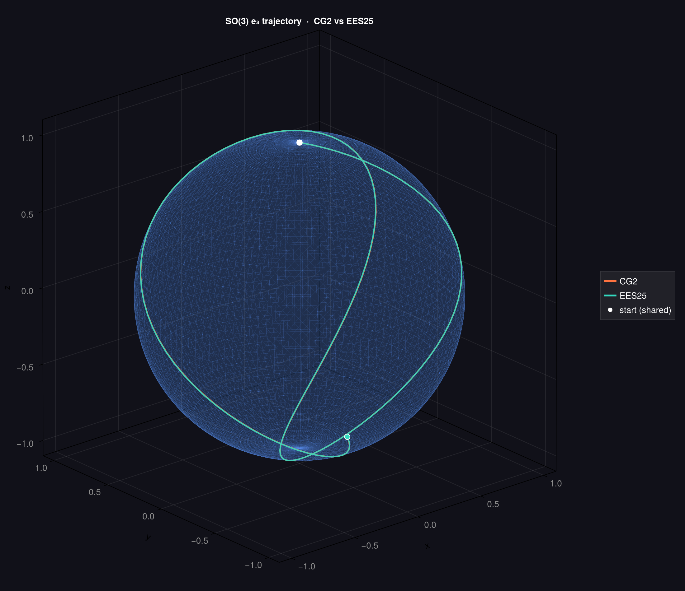

# EffectivelySymmetric.jl

A 3-stage, 5th-order effectively-symmetric integrator (EES25) for the [SciML](https://sciml.ai) ecosystem.

EES25 is a fixed-step explicit method whose antisymmetric defect is $O(h^6)$. This makes it ideal for long-time structure-preserving integration and memory-efficient discrete adjoints via backward reconstruction (no checkpointing needed).

## Installation

```julia
using Pkg
Pkg.add(url="https://github.com/<org>/EffectivelySymmetric.jl")
```

## Algorithms

The package provides three variants of the same method, each targeting a different solver backend. Install only the backend(s) you need.

### `EES25()`: Standard ODE

Always available. Works with any `ODEProblem`.

```julia
using EffectivelySymmetric, OrdinaryDiffEqCore

prob = ODEProblem(f, u0, tspan)
sol  = solve(prob, EES25(); dt = 0.01)
```

### `EES25_2N()`: 2N Low-Storage

Activated by loading `OrdinaryDiffEqLowStorageRK`. Uses the Williamson 2N recurrence for minimal memory overhead -- two registers per DOF regardless of stage count.

```julia
using EffectivelySymmetric, OrdinaryDiffEqLowStorageRK

sol = solve(prob, EES25_2N(); dt = 0.01)
```

### `CFEES25()`: Commutator-Free Lie-Group

Activated by loading `OrdinaryDiffEqLinear`, `ExponentialUtilities`, and `SciMLOperators`. Solves linear ODEs of the form `du/dt = A(u,t) u` using matrix exponentials, preserving Lie-group structure (e.g. $\mathrm{SO}(n)$ orthogonality).

```julia
using EffectivelySymmetric
using OrdinaryDiffEqLinear, SciMLOperators, ExponentialUtilities

op   = MatrixOperator(A0; update_func! = update_A!)
prob = ODEProblem(op, u0, tspan)
sol  = solve(prob, CFEES25(); dt = 0.01)
```

## Method

The 3-stage recurrence in 2N form:

```
A = [   0,  -0.5,  -2.0]
B = [ 0.5,   1.0,  0.25]
C = [ 0.0,   0.5,   1.0]
```

The commutator-free variant replaces additions with matrix exponentials:

```
K1 = h A(t, Y0)
Y1 = exp(0.5  K1) Y0

K2 = h A(t+h/2, Y1)
Y2 = exp(-0.5 K1 + K2) Y1

K3 = h A(t+h, Y2)
Y_next = exp(0.25 (-2(-0.5 K1 + K2) + K3)) Y2
```

## Examples

`examples/so3_sphere.jl` solves a state-dependent $\mathrm{SO}(3)$ ODE and compares CG2 with CFEES25. Both traces agree on the forward trajectory; the difference is in the antisymmetric error order (CG2: 3, EES25: 6).



## Citation
If you use this package, please cite the paper _Explicit and Effectively Symmetric Runge-Kutta Methods_:
```bibtex
@misc{https://doi.org/10.48550/arxiv.2507.21006,
  doi = {10.48550/ARXIV.2507.21006},
  url = {https://arxiv.org/abs/2507.21006},
  author = {Shmelev,  Daniil and Ebrahimi-Fard,  Kurusch and Tapia,  Nikolas and Salvi,  Cristopher},
  keywords = {Numerical Analysis (math.NA),  Classical Analysis and ODEs (math.CA),  Rings and Algebras (math.RA),  FOS: Mathematics,  FOS: Mathematics,  16T05,  65L05,  65L06,  05C05},
  title = {Explicit and Effectively Symmetric Runge-Kutta Methods},
  publisher = {arXiv},
  year = {2025},
  copyright = {arXiv.org perpetual,  non-exclusive license}
}
```

## License

Apache 2.0
